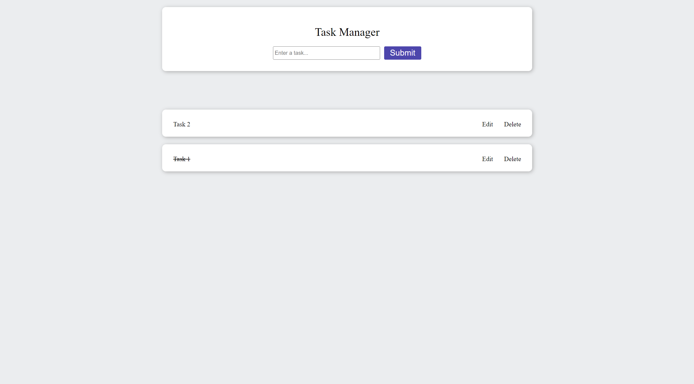
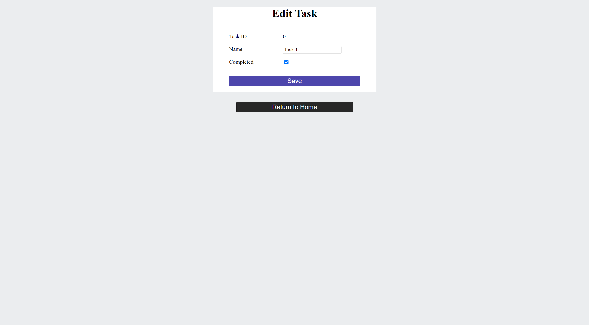

# Task Manager - UI
This is the UI part of the Task Manager project developed with Angular. It communicates with the back-end server to perform basic CRUD operations.

Task Manager is a simple TODO web application. You can create, edit and delete tasks.

## Screenshots

## Structure
Task Manager uses REST API. The back-end server must be running for the application to function properly. The default URL for the web API is "http://localhost:8080/api/task" as the web API I developed runs on this URL. To change the URL, "webApiUrl" in the file "task.service.ts" needs to be updated.

The repository for back-end can be accessed from [here](https://github.com/UtkuOktay/TaskManager_WebAPI).